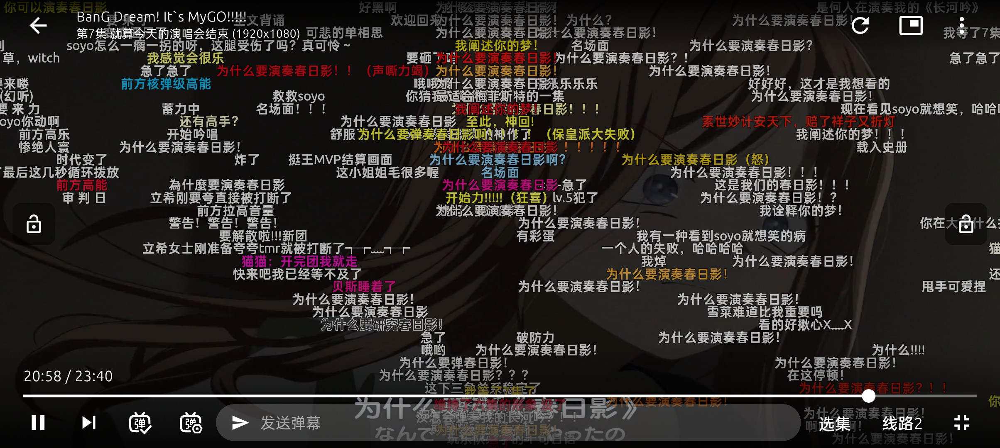

<h1 align="center">AniCh</h1>

个人学习修改版：[功能、使用方式与验证说明](MODIFICATIONS.zh-CN.md)。

[Windows EXE 构建成功记录](https://github.com/duolaxing/AniCh-study/actions/runs/37455667318) · [下载 Windows x64 便携版](https://github.com/duolaxing/AniCh-study/actions/runs/37455667318/artifacts/11408679128)

一个支持超分辨率的在线动漫弹幕APP。多平台，多番剧源，多弹幕，高清无广告。追番看番必备软件。

## 下载

点击前往 [发布页](https://github.com/Sle2p/AniCh/releases/latest) 下载

## 预览
开发中。实际样式请以最新版本为准。

|  |  |
| ---- | ---- |

|  |  |
| ---- | ---- |

## 功能

- [x] 超分辨率
- [x] 番剧索引
- [x] 番剧搜索
- [x] 倍速播放
- [x] 观看记录
- [x] 追番管理
- [x] 番剧弹幕
- [x] 弹幕举报
- [x] 弹幕过滤
- [x] 分集评论
- [x] 离线缓存
- [ ] 番剧评分
- [ ] ...

## 说明

> [!IMPORTANT]
> 源码对应版本 [1.0.0](https://github.com/Sle2p/AniCh/releases/tag/1.0.0)
>
> 日期：2024-08-25
